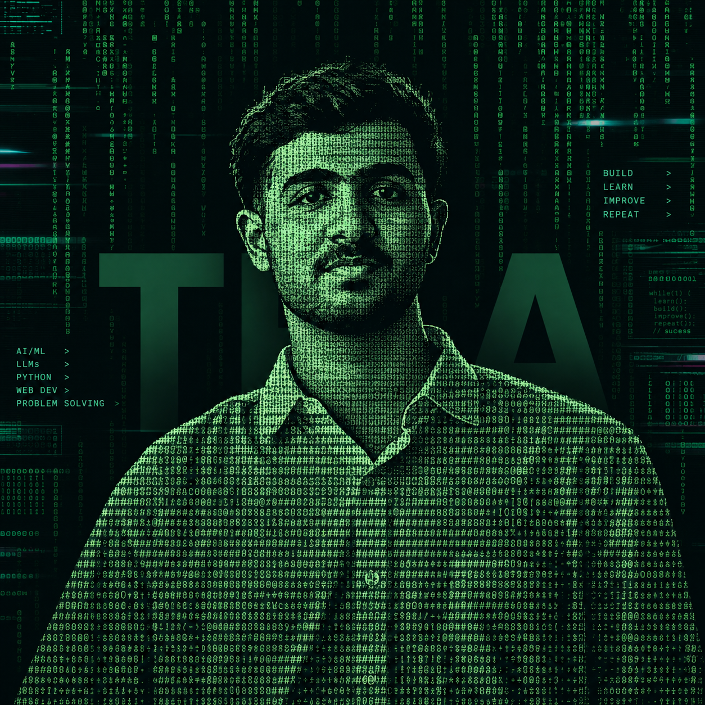

<h1>Hey there, I'm Thoofik Usmaan A 👋</h1>

  

  

  

  

  

  

  

 

---

<table align="center" width="100%">
<tr>

<td width="65%" valign="top">

## 👨‍💻 About Me

I'm **Thoofik Usmaan A**, a Computer Science Engineering student
passionate about **Artificial Intelligence, Machine Learning,
Large Language Models, and Full-Stack Development**.

I enjoy building practical applications that combine intelligent
systems with modern web technologies — from **concept → design →
development → testing → deployment**.

- 🤖 Artificial Intelligence & Machine Learning
- 🧠 Large Language Models & Generative AI
- 🐍 Python & AI/ML Development
- 🌐 Full-Stack Web Development
- ⚡ Next.js, React & TypeScript
- 🔥 Firebase & Backend Development
- 🔗 AI API & LLM Integrations
- 🚀 Building Real-World Applications

> **Learn. Build. Experiment. Improve. Repeat.**

</td>

<td width="35%" align="center" valign="middle">

</td>

</tr>
</table>

  

## 🚀 Featured Projects

<table>
<tr>

<td width="50%" valign="top">

### 🩺 CuraPath AI

An AI-powered healthcare platform featuring dedicated
**Doctor, Patient, and Staff portals**, intelligent symptom
analysis, patient management, access control, and AI-assisted
health analytics.

**React • TypeScript • Python • Flask • Groq • AI/ML**

</td>

<td width="50%" valign="top">

### 🤖 CareerSync AI

An AI-powered interview preparation platform featuring
**technical & behavioral mock interviews, voice-based AI
interviews, peer rounds, personalized feedback, and ATS-style
resume analysis**.

**Next.js • TypeScript • Firebase • Llama 3.3 • Groq • Deepgram • ElevenLabs**

</td>

</tr>

<tr>

<td width="50%" valign="top">

### 🌐 SitePulse

A comprehensive website auditing platform that analyzes
**performance, security, SEO, and accessibility**, with
real-time progress tracking, interactive reports, and
automated webpage screenshots.

**React • Python • Flask • WebSockets • Lighthouse • Selenium**

</td>

<td width="50%" valign="top">

### 🏫 CSD Department Website

A modern responsive website for the **Computer Science and
Design Department at PESITM**, featuring department information,
faculty profiles, achievements, facilities, contact information,
and responsive UI.

**Next.js • TypeScript • Tailwind CSS • Framer Motion**

</td>

</tr>
</table>

 

 

<b>© Thoofik Usmaan A</b> · AI/ML · LLMs · Software Development

